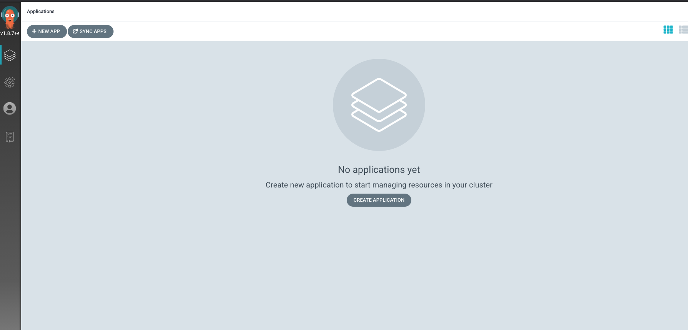

## Instructions

In this batch of instructions we're going to deploy a popular GitOps supporting tool called [ArgoCD](https://argo-cd.readthedocs.io/en/stable/).

### Step 1 - Make sure kubectl can talk to your cluster

Argo is deployed via Kubernetes YAML files so we'll need to make sure that your `kubectl` tool has been configured to point at the right cluster.

We can check this by running a sample `kubectl` command such as:

```
kubectl get nodes
```

If you see some nodes listed then we're all good to continue. If it fails jump back to [Step 9 of the Provisioning instructions](./PROVISIONING.md) and once you've sorted that you can return here for the next step.

### Step 2 - Deploy Argo

Argo runs in a [Kubernetes namespace](https://kubernetes.io/docs/concepts/overview/working-with-objects/namespaces/) so that it is separate from other containers and namespaces in your cluster.

Run this command to create the target namespace

```
kubectl create namespace argocd
```

Once your namespace has been created you can deploy ArgoCD

```
kubectl apply -n argocd -f https://raw.githubusercontent.com/argoproj/argo-cd/stable/manifests/install.yaml
```

This will take a few moments to deploy the various containers and services for Argo.

You can check its progress by running

```
kubectl get pods -n argocd
```

Once all the pods have a **STATUS** of **Running** you can move to the next step.

### Step 3 - Grab the ArgoCD password

You'll need the ArgoCD password for navigating into the dashboard. (We'll do this shortly)

By default, ArgoCD generates a password for you. To extract this run the following command:

```
kubectl get pods -n argocd -l app.kubernetes.io/name=argocd-server -o name | cut -d'/' -f 2
```

If that password doesn't work try running this command to obtain the password (they changes it between version 1.8 and 1.9):

```
kubectl -n argocd get secret argocd-initial-admin-secret -o jsonpath="{.data.password}" | base64 -d
```

(If you see a % sign as the last character that is just signalling the end of line and is NOT part of the password)

### Step 4 - Port forwarding into the ArgoCD dashboard

We can use `kubectl` to port forward requests from our machine into the cluster. 

This is a fairly common technique for viewing a web application on the cluster that you do not wish to publicly expose.

To port forward local requests for port 9000 into Argo running on port 443 you can run:

```
kubectl port-forward svc/argocd-server -n argocd 9000:443
```

Then you should be able to visit [http://localhost:9000](http://localhost:9000). It will likely tell you that the certificate cannot be verified. This is because you haven't provisioned a full SSL certificate. You can ignore this warning and follow the instructions to "Visit the site anyway"

Enter the **username** of **admin** and the password displayed from the previous step to log in to the ArgoCD dashboard.

Once you have confirmed that you can see the Argo dashboard you can head back to the [README](../README.md) and move on to step 4.

It should look something similar to this:

